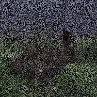
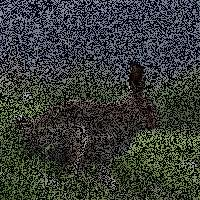

# Reconstrucción de imágenes 2D con Deep Learning

Una implementación de métodos de reconstrucción de imágenes de [Deep Image Prior (Ulyanov et al., 2017)](https://arxiv.org/abs/1711.10925) en PyTorch.

El objetivo del documento es ejecutar algunas tareas comunes de manipulación de imágenes utilizando redes neuronales sin entrenamiento en datos antes de su uso.

Las arquitecturas difieren de las utilizadas en el documento real. Los autores utilizan algunas redes específicas para tareas específicas. Este repositorio utiliza un par de arquitecturas alternativas para producir resultados similares. Uno en el que el muestreo se realiza sobre la base de la barajada de píxeles y el otro utilizando convoluciones transpuestas. La reproducción aleatoria de píxeles da como resultado algunos puntos de acceso que no desaparecen con más entrenamiento.

## Requisitos

Python3 con PyTorch, torchvision y NumPy. CUDA y cuDNN son opcionales (configurables dentro del script de forma autoexplicativa) pero muy recomendables.

## Usar

Es relativamente fácil jugar con la configuración desde los scripts. Para reproducir los resultados en el repositorio, haga lo siguiente.

Cree un directorio para contener la salida de la red:
```bash
mkdir output
```

Genere imágenes de salida con:
```bash
python3 deep_image_prior.py
```

Consolide las imágenes de salida en un gif de entrenamiento y pruebe algunos datos reales con:
```bash
python3 parse_ec2_results.py
```

## Resultados

Tenga en cuenta que las imágenes aquí se han reducido para formatear con sensatez en el LÉAME. Las muestras de tamaño completo están en el repositorio si desea ver más de cerca.

El entrenamiento se realizó en más de 25 000 iteraciones en una instancia de GPU de Amazon. Toma aproximadamente una hora en imágenes de 512x512.

### Upsampling con convoluciones transpuestas:
Tenga en cuenta la cuadrícula como puntos (manchas) durante el entrenamiento. Estos son causados por núcleos convolucionales que se superponen entre sí durante el upsampling.

Ground truth | Input | Output | Training
------------ | ----- | ------ | --------
|||

### Upsampling con barajado de píxeles:

No hay manchas, sin embargo, hay un punto de acceso (en la región desenfocada hacia la parte trasera del conejito) que se convierte en un punto negro. La apariencia de estos puntos de acceso parece un lugar común en ambas arquitecturas, pero la suavidad adicional proporcionada por las capas transpuestas de convolución las repara de manera más efectiva.

Ground truth | Input | Output | Training
------------ | ----- | ------ | --------
|||
